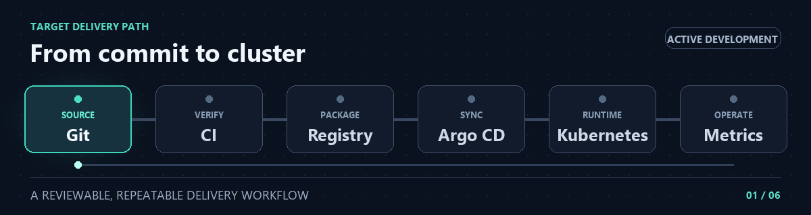

<p align="center">
  <strong>PLATFORM ENGINEERING &nbsp;·&nbsp; KUBERNETES &nbsp;·&nbsp; GITOPS</strong>
</p>

<h1 align="center">Internal Developer Platform</h1>

<p align="center">
  From a Git change to a scanned image, a healthy Kubernetes workload, and resource dashboards.
</p>

<p align="center">
  
  
  
  
</p>

<p align="center">
  <a href="https://github.com/Rano1000/internal-developer-platform/actions/workflows/reference-service-ci.yaml">
    
  </a>
</p>

<p align="center">
  <br>
  <sub>Target delivery architecture · CI, image scanning, registry publishing, GitOps, and Kubernetes resource dashboards are implemented.</sub>
</p>

<p align="center">
  <a href="#current-implementation">Implemented</a> &nbsp;·&nbsp;
  <a href="docs/image-delivery.md">Image delivery</a> &nbsp;·&nbsp;
  <a href="docs/development-security.md">Security controls</a> &nbsp;·&nbsp;
  <a href="docs/monitoring.md">Monitoring</a> &nbsp;·&nbsp;
  <a href="#getting-started">Get started</a> &nbsp;·&nbsp;
  <a href="docs/architecture.md">Architecture</a> &nbsp;·&nbsp;
  <a href="#project-roadmap">Roadmap</a>
</p>

---

## Overview

The Internal Developer Platform provides a growing foundation for building, deploying, and operating containerized services on Kubernetes. Application code, delivery automation, and deployment configuration are versioned together, making the delivery path visible and reviewable.

The current implementation connects **GitHub Actions**, **GitHub Container Registry**, and **Argo CD** to a dedicated local Kubernetes environment. CI builds the reference-service image, checks its HTTP endpoints, scans its dependencies, and publishes passing images to GHCR. A Git change selects the image to deploy, and Argo CD reconciles the declared configuration with Kubernetes.

The verified development baseline includes resource policies, container security settings, application network restrictions, scoped Argo CD projects, and read-only observer access.

**Prometheus** collects Kubernetes metrics, and **Grafana** displays workload CPU, memory, and network dashboards. Persistent storage has been verified to retain historical metrics across a Prometheus pod replacement.

Additional environments, human access provisioning, managed secrets, application-specific telemetry, alert notifications, and broader recovery procedures remain on the roadmap.

The platform is under active development. The local verification results do not establish production readiness.

## Current implementation

| Component | Implemented behavior |
| --- | --- |
| Local Kubernetes | A dedicated, single-node kind cluster named `internal-developer-platform`. |
| Development environment | A namespace, ResourceQuota, and LimitRange declared in Git. |
| Reference service | Flask and Gunicorn expose service metadata at `/` and health status at `/health`. |
| Container image | An Alpine-based Python image installs application dependencies and removes pip from the runtime filesystem. |
| Base image source | The Dockerfile pulls the Python base image from the Docker Official Images repository on ECR Public. |
| Container identity | The application runs with user and group ID `10001`. |
| Continuous integration | GitHub Actions builds the image, starts a container, checks both HTTP endpoints, scans vulnerabilities, and displays application logs. |
| Security gate | Trivy blocks publication when it detects HIGH or CRITICAL vulnerabilities, including findings without available fixes. |
| Image registry | Successful non-pull-request runs on `main` publish the checked image to GHCR, tagged with the source commit SHA. |
| Workload deployment | One replica runs an image explicitly selected in the Deployment manifest. |
| Internal networking | A ClusterIP Service exposes port `8080` and selects application Pods by label. |
| Health checks | HTTP readiness and liveness probes check `/health` with separate timing settings. |
| Resource budget | The container requests `100m` CPU and `64Mi` memory, with limits of `500m` CPU and `128Mi` memory. |
| Runtime security | Kubernetes enforces non-root execution, disables privilege escalation, drops Linux capabilities, and applies the runtime's default seccomp profile. |
| API credentials | Automatic service-account token mounting is disabled for the reference service and observer ServiceAccount. |
| Network restrictions | A NetworkPolicy limits application ingress to labelled callers in `development` and egress to CoreDNS. |
| Observer access | A ServiceAccount, Role, and RoleBinding grant read access to development workload status and logs. |
| Argo CD installation | Kustomize installs Argo CD from the official `v3.5.4` manifests into the `argocd` namespace. |
| GitOps applications | Separate Applications manage the reference-service workload and development environment resources. |
| Deployment scope | Separate AppProjects constrain the permitted Git repository, destination, and resource types for each Application. |
| Automatic sync | Argo CD applies changes to tracked manifests automatically. |
| Self-healing | Argo CD restores managed configuration when the live cluster differs from Git. |
| Monitoring installation | A Helm script installs the pinned `kube-prometheus-stack` chart, version `92.2.0`, into `monitoring`. |
| Metrics collection | Prometheus collects Kubernetes metrics, including kubelet, kube-state-metrics, and node-exporter data. |
| Dashboards | Grafana displays Kubernetes resource and network dashboards. |
| Monitoring persistence | Prometheus and Grafana use local-path persistent volumes. Metric history survived a Prometheus pod replacement. |
| Grafana credentials | A manually provisioned Kubernetes Secret supplies the administrator credentials outside Git. |

## Delivery workflow

1. **Commit:** Application changes enter the repository.
2. **Build and check:** GitHub Actions builds a container image, starts it, and checks `/health` and `/`.
3. **Scan:** Trivy checks the image for HIGH and CRITICAL vulnerabilities.
4. **Publish:** Passing runs on `main` publish the checked image to GHCR using the source commit SHA as its tag.
5. **Select a release:** Update the image reference in the development Deployment, then commit and push that configuration.
6. **Reconcile:** Argo CD reads the manifests from Git and applies the declared configuration to Kubernetes.
7. **Verify:** Confirm the Git revision, running image, readiness, and responses through the Kubernetes Service.
8. **Observe:** Inspect workload resource usage in Grafana.

> **Release selection is explicit.** Publishing a new image does not automatically change the deployed version. The image reference committed in the Deployment determines the selected release.

Pull requests targeting `main` run the build, endpoint checks, and vulnerability scan. Registry login and publishing run only for non-pull-request events on `main`. The workflow also supports manual execution.

See the [image delivery guide](docs/image-delivery.md) for release selection and verification, and the [CI workflow](.github/workflows/reference-service-ci.yaml) for the implemented checks.

## Development guardrails

| Control | Current policy |
| --- | --- |
| Container requests | `100m` CPU and `64Mi` memory for the reference service. |
| Container limits | `500m` CPU and `128Mi` memory for the reference service. |
| Namespace request budget | Aggregate requests up to `1` CPU and `512Mi` memory. |
| Namespace limit budget | Aggregate limits up to `2` CPUs and `1Gi` memory. |
| Pod count | Up to `10` Pods, subject to the resource budgets. |
| Container defaults | LimitRange supplies requests of `100m` / `64Mi` and limits of `500m` / `128Mi` when omitted. |
| Application ingress | TCP port `8080` from same-namespace Pods labelled `access: reference-service`. |
| Application egress | DNS over UDP and TCP port `53` to CoreDNS Pods in `kube-system`. |
| Observer permissions | Read Pods, Services, Events, Deployments, ReplicaSets, and Pod logs in `development`. |
| Workload AppProject | Permits Deployments, Services, and NetworkPolicies in `development` from the configured repository. |
| Environment AppProject | Permits the `development` Namespace, ResourceQuota, LimitRange, ServiceAccounts, Roles, and RoleBindings. |

ResourceQuota checks declared resource totals rather than live CPU or memory consumption. A workload must fit every applicable budget.

The NetworkPolicy selects reference-service Pods. It does not isolate every Pod in the namespace, and the caller label is a traffic-selection convention rather than an authentication mechanism.

The AppProjects constrain deployment through Argo CD. Kubernetes RBAC separately controls API access, while NetworkPolicy controls selected Pod traffic.

The observer identity has been tested for allowed status and log access, denied Deployment modification, denied Secret access, and denied Pod listing in `argocd`. It does not provision a human login or deploy an observer application.

See the [development security guide](docs/development-security.md) for policy details, verification commands, and limitations.

## GitOps behavior

| Setting | Current behavior |
| --- | --- |
| Git source | `Rano1000/internal-developer-platform`, branch `main`. |
| Workload path | `platform/environments/development/reference-service`. |
| Environment path | `platform/environments/development`, with directory recursion disabled. |
| Destination | The cluster where Argo CD runs, namespace `development`. |
| Automatic sync | Enabled for both Applications. |
| Self-healing | Enabled for both Applications. |
| Automatic pruning | Disabled. Removing a manifest from Git does not automatically delete its live resource. |

The workload Application manages the Deployment, Service, and NetworkPolicy. The environment Application manages the Namespace, resource policies, and observer access resources without including the nested workload directory.

Application and AppProject definitions live in `argocd`. The application workload and environment resources apply to `development`.

Argo CD, its AppProjects, and its Application definitions are bootstrapped separately. The current Applications manage their configured manifest paths; they do not manage their own definitions or the Argo CD installation.

Monitoring is also bootstrapped separately through Helm. Its configuration is versioned in Git, but changing that configuration requires running the monitoring installation script.

Git polling is periodic. Check the reported revision before interpreting `Synced` as confirmation that the latest commit has been deployed.

## Monitoring

The monitoring stack runs in its own namespace, separate from the development workload's resource quota.

| Setting | Current configuration |
| --- | --- |
| Chart | `prometheus-community/kube-prometheus-stack`, version `92.2.0`. |
| Prometheus | One replica, with scrape and evaluation intervals of `30s`. |
| Retention | Bounded by `24h` and a size threshold of `1GiB`. |
| Prometheus storage | A `2Gi` persistent volume claim using `standard`. |
| Grafana storage | A `1Gi` persistent volume claim using `standard`. |
| Grafana memory | A request of `512Mi` and limit of `1Gi` for the main container. |
| Grafana access | Local port forwarding with administrator credentials from an existing Secret. |
| Alertmanager | Disabled in the current baseline. |

Grafana's development workload dashboards show actual CPU and memory consumption relative to configured requests and limits. Network dashboards also display Kubernetes Pod traffic.

The current stack collects infrastructure and workload resource metrics. Application-specific HTTP request counts, latency, and error rates have not been instrumented.

Local-path volumes retain data across pod replacement while the node and volumes remain available. They are not a backup or a recovery mechanism for deletion of the kind cluster.

See the [monitoring guide](docs/monitoring.md) for installation, browser access, dashboard checks, troubleshooting, and the metric-history recovery procedure.

## Verified behavior

The implemented baseline has been checked through:

- Successful image builds and HTTP endpoint checks in GitHub Actions.
- A passing HIGH/CRITICAL vulnerability scan before image publication.
- Pulling a published GHCR image into Kubernetes.
- Confirming the selected image is running and ready.
- Successful requests to both endpoints through the Kubernetes Service's DNS name before application network restrictions were introduced.
- Git-driven scaling from one replica to two and back to one.
- Restoring one replica after the live Deployment was manually scaled to two.
- ResourceQuota rejecting an over-budget server-side dry-run request.
- LimitRange injecting resource defaults during a server-side dry run.
- Runtime checks confirming UID/GID `10001`, dropped capabilities, no privilege escalation, seccomp filtering, and no mounted API token.
- A labelled client reaching `/health` while an unlabelled client timed out.
- The protected application resolving its Service name through DNS.
- The protected application timing out when connecting to a temporary HTTP server that an unrestricted client could reach.
- The observer identity listing development Pods and reading application logs.
- Authorization checks denying observer Deployment modification, Secret access, and Pod listing in `argocd`.
- Automatic reconciliation of the observer configuration from Git.
- Both Applications reporting **Synced** and **Healthy** under their assigned AppProjects.
- A deployed monitoring Helm release with ready monitoring components and bound persistent volume claims.
- Successful Grafana login and populated Kubernetes resource and network dashboards.
- Prometheus reporting successful scrapes for kubelet metrics, cAdvisor metrics, and probe metrics.
- Grafana displaying development CPU and memory utilisation against both requests and limits.
- Grafana remaining ready with zero restarts during an extended dashboard session after its memory budget was increased.
- Kubernetes replacing the Prometheus pod and returning it to `2/2 Running`.
- A historical CPU-request query returning the same value before and promptly after the Prometheus pod replacement.

A passing scan reflects the selected severities and vulnerability database available at scan time. Findings can change as the database is updated.

Dashboard values are observations at a particular time. They do not establish performance under load.

### Reliability observations

Controller DNS failures and kindnet API watch timeouts occurred during local operation. Targeted restarts restored the affected behavior, and network enforcement was subsequently verified with allowed and denied connections.

The underlying causes remain unresolved. These recoveries do not establish a permanent fix. The [development security guide](docs/development-security.md) records the network-controller incident and diagnostic commands.

Grafana initially experienced startup failures and later reported `OOMKilled` under its original memory limit. Adding a startup probe and increasing its main container's memory budget resolved the observed restarts during subsequent verification. The [monitoring guide](docs/monitoring.md) records these settings and diagnostic commands.

A CI build also encountered Docker Hub `429 Too Many Requests` responses while resolving the Python base image. Changing the base image source to ECR Public was followed by successful local and CI builds.

## Getting started

Use Docker, kind, kubectl, and Git. Helm is also required for the monitoring installation. Start with the [local development guide](docs/local-development.md) for prerequisites, cluster creation, and local recovery.

Clone the repository if needed, then run the remaining commands from its root:

```bash
git clone https://github.com/Rano1000/internal-developer-platform.git
cd internal-developer-platform
```

### Bootstrap the development environment

With the `internal-developer-platform` cluster running, create the development namespace and its resource policies:

```bash
kubectl apply --context kind-internal-developer-platform \
  -f platform/environments/development/namespace.yaml

kubectl apply --context kind-internal-developer-platform \
  -f platform/environments/development/resource-quota.yaml

kubectl apply --context kind-internal-developer-platform \
  -f platform/environments/development/limit-range.yaml
```

Install Argo CD using the pinned Kustomize configuration:

```bash
kubectl apply --context kind-internal-developer-platform \
  --server-side \
  -k platform/components/argocd
```

Check Argo CD's Pods. Proceed once all its containers report ready:

```bash
kubectl get pods --namespace argocd \
  --context kind-internal-developer-platform
```

Create the AppProjects before registering the Applications that use them:

```bash
kubectl apply --context kind-internal-developer-platform \
  -f platform/projects/development-environment.yaml

kubectl apply --context kind-internal-developer-platform \
  -f platform/projects/development-workloads.yaml
```

Register the environment Application so Argo CD manages the namespace, resource policies, and observer access:

```bash
kubectl apply --context kind-internal-developer-platform \
  -f platform/applications/development-environment.yaml
```

Register the workload Application so Argo CD deploys the reference service and its network policy from Git:

```bash
kubectl apply --context kind-internal-developer-platform \
  -f platform/applications/reference-service-development.yaml
```

Check both Applications:

```bash
kubectl get applications --namespace argocd \
  --context kind-internal-developer-platform
```

Expect **Synced** and **Healthy** once reconciliation completes. Confirm their reported revisions match the intended Git revision. If an Application reports an error, inspect its conditions before continuing.

### Access the reference service

Forward the Service to a local port:

```bash
kubectl port-forward --context kind-internal-developer-platform \
  --namespace development --address 127.0.0.1 \
  service/reference-service 8080:8080
```

Keep that terminal running. From another terminal, request the health endpoint:

```bash
curl --fail http://127.0.0.1:8080/health
```

Expected response:

```json
{"status":"healthy"}
```

| Endpoint | Purpose |
| --- | --- |
| `http://127.0.0.1:8080/` | Returns the service name and application version. |
| `http://127.0.0.1:8080/health` | Returns the application's health response. |

Port forwarding provides administrative access for local inspection. Use Pod-to-Pod traffic tests to verify the network policy, as described in the security guide.

### Install monitoring

Follow the [monitoring guide](docs/monitoring.md) to create the monitoring namespace and Grafana administrator Secret.

Once the Secret exists, install or upgrade the pinned Helm release:

```bash
bash platform/components/monitoring/install.sh
```

The guide includes readiness checks, Windows browser access through WSL, dashboard navigation, and the metric-history recovery test.

## Documentation

| Guide | Coverage |
| --- | --- |
| [Architecture](docs/architecture.md) | Target design, component responsibilities, and delivery boundaries. |
| [Local development](docs/local-development.md) | Local setup, verification, access, and recovery. |
| [Image delivery](docs/image-delivery.md) | CI checks, the vulnerability gate, release identity, image selection, and deployment verification. |
| [Development security](docs/development-security.md) | Resource budgets, container settings, network restrictions, observer permissions, and recovery observations. |
| [Monitoring](docs/monitoring.md) | Helm installation, Grafana access, resource dashboards, persistent storage, troubleshooting, and metric-history recovery. |

## Project roadmap

| Milestone | Outcome | Status |
| --- | --- | --- |
| Foundation | Repository structure, platform architecture, and Git workflow | Complete |
| Workload | Local Kubernetes cluster, reference service, internal routing, and health probes | Complete — local baseline |
| Delivery | CI checks, vulnerability scanning, image publishing, GitOps deployment, and drift correction | In progress — core workflow verified; controller reliability investigation remains |
| Guardrails | Resource policies, scoped deployment permissions, environment boundaries, and security controls | In progress — resource, runtime, network, and observer access controls verified |
| Operations | Metrics, dashboards, alerting, and expanded recovery procedures | In progress — monitoring baseline and metric-history recovery across pod replacement verified |

The monitoring baseline milestone is complete: installation, resource dashboards, Grafana stability checks, and retention of historical metrics across a Prometheus pod replacement have been verified.

Further work includes:

- Additional environments and promotion between them.
- External routing and TLS.
- Autoscaling and workload verification under load.
- Human authentication and access provisioning.
- Managed application secrets.
- Investigation of recurring controller DNS and networking issues.
- Application-specific HTTP metrics.
- Alert notification delivery.
- Backup restoration and recovery after cluster loss.

The current service has no secret dependency. A managed application-secret system has not been implemented. The container filesystem also remains writable.

## Repository layout

```text
.
├── .github/
│   └── workflows/
│       └── reference-service-ci.yaml       # Build, test, scan, and publish
├── .gitignore                             # Local environments and Python caches
├── README.md                              # Overview and implementation progress
├── apps/
│   └── reference-service/
│       ├── .dockerignore                  # Files excluded from image builds
│       ├── Dockerfile                     # Runtime image and startup command
│       ├── app.py                         # Application and health endpoints
│       └── requirements.txt               # Application dependency versions
├── docs/
│   ├── architecture.md                    # Target design and responsibilities
│   ├── development-security.md            # Controls, verification, and limitations
│   ├── image-delivery.md                  # Image checks and release selection
│   ├── local-development.md               # Local setup and recovery
│   ├── monitoring.md                      # Dashboards, storage, and recovery checks
│   └── assets/
│       ├── delivery-flow.gif              # Target delivery illustration
│       └── local-cluster.gif              # Local environment illustration
└── platform/
    ├── applications/
    │   ├── development-environment.yaml   # Environment resource reconciliation
    │   └── reference-service-development.yaml
    ├── components/
    │   ├── argocd/
    │   │   ├── kustomization.yaml         # Pinned Argo CD installation
    │   │   └── namespace.yaml             # Argo CD namespace
    │   └── monitoring/
    │       ├── install.sh                 # Pinned Helm installation and upgrades
    │       ├── namespace.yaml             # Monitoring namespace
    │       └── values.yaml                # Resources, storage, and Grafana settings
    ├── environments/
    │   └── development/
    │       ├── limit-range.yaml           # Default container resource settings
    │       ├── namespace.yaml             # Development namespace
    │       ├── observer-role-binding.yaml # Assigns observer permissions
    │       ├── observer-role.yaml         # Read-only workload permissions
    │       ├── observer-service-account.yaml
    │       ├── resource-quota.yaml        # Aggregate namespace resource budget
    │       └── reference-service/
    │           ├── deployment.yaml        # Image, probes, resources, and security
    │           ├── network-policy.yaml    # Application traffic restrictions
    │           └── service.yaml           # Internal application routing
    └── projects/
        ├── development-environment.yaml   # Environment deployment permissions
        └── development-workloads.yaml     # Workload deployment permissions
```

Application source and image packaging live under `apps/`. Shared platform installations live under `platform/components/`. Argo CD assignments live under `platform/applications/`, their deployment permissions under `platform/projects/`, and environment manifests under `platform/environments/`.

---

<p align="center">
  <strong>Current milestone: scanned GitOps delivery, verified development controls, and persistent resource monitoring.</strong><br>
  <a href="#getting-started">Run the local platform</a> &nbsp;·&nbsp;
  <a href="docs/image-delivery.md">Follow the release process</a> &nbsp;·&nbsp;
  <a href="docs/development-security.md">Inspect security controls</a> &nbsp;·&nbsp;
  <a href="docs/monitoring.md">Inspect monitoring</a> &nbsp;·&nbsp;
  <a href="https://github.com/Rano1000/internal-developer-platform/actions">View delivery runs</a>
</p>
