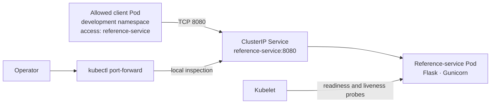
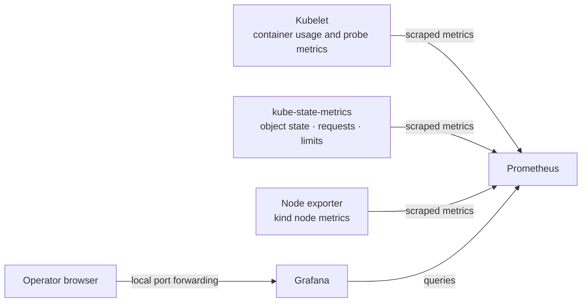

  <strong>INTERNAL DEVELOPER PLATFORM &nbsp;·&nbsp; SYSTEM DESIGN</strong>

<h1 align="center">Platform Architecture</h1>

  From an application change to a scanned image, a controlled Kubernetes deployment, and resource dashboards.

  
  
  

  

  <a href="../README.md">Project overview</a> &nbsp;·&nbsp;
  <a href="#system-map">System map</a> &nbsp;·&nbsp;
  <a href="#application-runtime">Application runtime</a> &nbsp;·&nbsp;
  <a href="#monitoring">Monitoring</a> &nbsp;·&nbsp;
  <a href="#design-decisions">Design decisions</a>

---

This document describes the implemented local MVP, first marked by release tag **v0.1.0**. It covers the delivery workflow, runtime boundaries, development controls, and monitoring verified in the local environment.

## Design intent

The platform provides a repeatable route for building and deploying a containerized service. Application source, published images, and deployment configuration have distinct responsibilities.

The implementation makes three questions answerable:

- What source change produced the image?
- Which image has been selected for deployment?
- Does the running workload match the configuration in Git?

The MVP uses one local Kubernetes cluster, one development environment, and one reference service.

## System map

```mermaid
flowchart LR
    developer["Developer"] --> source["Application source<br/>GitHub"]
    source --> ci["GitHub Actions<br/>build · endpoint checks · scan"]
    ci --> registry["GitHub Container Registry"]

    developer --> release["Select image tag<br/>commit deployment configuration"]
    registry -.->|published image tag| release
    release --> config["Deployment manifests<br/>GitHub main"]
    config --> argo["Argo CD<br/>automatic sync · self-healing"]
    argo --> workload["Reference service<br/>development namespace"]
    registry -.->|image pull| workload

    classDef buildStep fill:#192E4D,color:#FFFFFF,stroke:#4B8FD6;
    classDef releaseStep fill:#194740,color:#FFFFFF,stroke:#44BFA6;
    classDef runtimeStep fill:#382B52,color:#FFFFFF,stroke:#9B7CDD;
    class source,ci,registry buildStep;
    class release,config,argo releaseStep;
    class workload runtimeStep;
```

Application source and deployment manifests live in the same repository. They are shown separately because building an image and selecting it for deployment are separate actions.

CI publishes passing images. The developer selects a published image by updating the Deployment manifest. Argo CD reads that configuration and reconciles the cluster.

Publishing an image does not automatically update the Deployment. CI does not connect directly to the Kubernetes cluster.

## Component responsibilities

| Component | Responsibility | Evidence |
| --- | --- | --- |
| GitHub repository | Versions application code, automation, platform configuration, and documentation. | Commits, manifest changes, and release tags. |
| GitHub Actions | Builds the image, checks HTTP endpoints, scans vulnerabilities, and publishes passing images. | Workflow logs and CI status. |
| Trivy | Checks the application image for HIGH and CRITICAL vulnerabilities, including findings without fixes. | Scan results and a publication gate. |
| GitHub Container Registry | Stores application images tagged with the source commit SHA. | A published image reference. |
| Argo CD | Reconciles tracked development manifests and corrects drift. | Application revision, sync status, and health status. |
| Kubernetes | Runs the application and enforces configured resource, runtime, and access controls. | Workload readiness and policy checks. |
| Prometheus | Collects and stores Kubernetes metrics. | Scrape status and historical queries. |
| Grafana | Displays dashboards backed by Prometheus. | Workload resource and network panels. |

The Python base image is pulled from the Docker Official Images repository on ECR Public. Built application images are published to GHCR.

Commit-based image tags identify the build used for release selection. The current Deployment uses a tag rather than a digest, so the reference is not enforced as immutable.

## Cluster and namespace boundaries

The runtime is a single-node kind cluster named `internal-developer-platform`.

Commands use the Kubernetes context `kind-internal-developer-platform`.

| Namespace | Responsibility |
| --- | --- |
| `argocd` | Argo CD controllers, AppProjects, and Application definitions. |
| `development` | Reference-service resources, namespace budgets, resource defaults, and observer access. |
| `monitoring` | Prometheus, Grafana, the monitoring operator, and supporting collectors. |
| `kube-system` | Kubernetes system components, CoreDNS, kindnet, and kube-proxy. |

Namespaces organize resources and provide scopes for policy. They share the same local node and cluster.

The development ResourceQuota applies to `development`. Monitoring has separately configured container budgets in its Helm values.

## GitOps ownership

Two Argo CD Applications divide responsibility:

| Application | Git path | Managed resources |
| --- | --- | --- |
| `development-environment` | `platform/environments/development` | Namespace, ResourceQuota, LimitRange, and observer ServiceAccount, Role, and RoleBinding. |
| `reference-service-development` | `platform/environments/development/reference-service` | Deployment, Service, and NetworkPolicy. |

Directory recursion is disabled for the environment Application. This keeps the nested reference-service resources under the workload Application.

Both Applications track `main`, use automatic sync, and enable self-healing. Automatic pruning is disabled.

Separate AppProjects constrain the source repository, destination, and permitted resource types:

- `development-environment` permits the development namespace, resource policies, and observer access resources.
- `development-workloads` permits Deployments, Services, and NetworkPolicies in `development`.

Argo CD installation, AppProjects, and Application definitions are bootstrapped with kubectl. The current Applications do not manage their own definitions.

Monitoring configuration is versioned in Git and applied through Helm.

## Application runtime

The reference service uses Flask and Gunicorn, listens on port `8080`, and runs as one replica.

| Endpoint | Response |
| --- | --- |
| `/` | Service name and application version. |
| `/health` | Application health status. |

A ClusterIP Service selects reference-service Pods by label.

Labelled clients in `development` can reach the service over TCP port `8080`. The application NetworkPolicy permits outgoing DNS traffic to CoreDNS over UDP and TCP port `53`.

Port forwarding provides local administrative access. Pod-to-Pod connection tests are used to verify NetworkPolicy enforcement.

Readiness and liveness probes both use `/health`, with different timing settings.

## Development controls

| Control | Implemented behavior |
| --- | --- |
| Container requests | `100m` CPU and `64Mi` memory. |
| Container limits | `500m` CPU and `128Mi` memory. |
| ResourceQuota | Bounds aggregate declared requests, limits, and Pod count in `development`. |
| LimitRange | Supplies default container requests and limits when omitted. |
| Runtime identity | Enforces non-root execution with user and group ID `10001`. |
| Runtime privileges | Disables privilege escalation, drops Linux capabilities, and uses `RuntimeDefault` seccomp. |
| API token mounting | Disabled for the reference-service Pod and observer ServiceAccount. |
| NetworkPolicy | Restricts selected application Pods to labelled ingress callers and DNS egress. |
| Observer RBAC | Allows development workload status and log access without modification or Secret access. |

These controls act at different boundaries:

- AppProjects constrain deployments through Argo CD.
- Kubernetes RBAC controls Kubernetes API operations.
- NetworkPolicy controls selected Pod traffic.
- Resource policies control declared resource budgets.
- Security contexts constrain container execution.

NetworkPolicy rules are additive. The caller label selects permitted traffic; it is not an authentication mechanism.

The observer is a Kubernetes ServiceAccount. Its permissions were verified using administrator impersonation, including allowed status and log reads and denied modification, Secret access, and cross-namespace Pod listing.

See the [development security guide](development-security.md) for the full policies and verification procedures.

## Monitoring

The monitoring stack is installed as Helm release `monitoring` using `kube-prometheus-stack` chart version `92.2.0`.

Prometheus collects Kubernetes infrastructure and workload resource metrics. Grafana displays CPU and memory usage relative to requests and limits, along with Kubernetes network dashboards.

The reference service does not currently expose an application metrics endpoint. Its HTTP request counts, latency, and error rates are not collected by this architecture.

| Setting | Configuration |
| --- | --- |
| Prometheus replicas | `1` |
| Scrape and evaluation intervals | `30s` |
| Retention | Bounded by `24h` and a size threshold of `1GiB` |
| Prometheus storage | `2Gi` persistent volume claim |
| Grafana storage | `1Gi` persistent volume claim |
| Storage class | `standard`, using local-path provisioning |
| Grafana credentials | Existing Kubernetes Secret `monitoring-grafana-admin`, created outside Git |
| Alertmanager | Disabled |

Grafana's main container requests `512Mi` memory and has a `1Gi` limit. A startup probe allows initialization before normal readiness and liveness checks take over.

See the [monitoring guide](monitoring.md) for installation, access, dashboards, and diagnostics.

## Release identity and recovery

CI tags published application images with the source commit SHA. The Deployment manifest records the selected image.

The Argo CD sync revision identifies the repository configuration being reconciled. It can differ from the image tag because a deployment change is committed after the image build.

Release tag `v0.1.0` marks the verified platform repository snapshot. It is separate from the reference-service image tag.

Git-driven scaling and self-healing were verified. A previous image can be selected by committing its reference in the Deployment manifest; a failed application-release rollback exercise has not been recorded.

Monitoring recovery was verified by replacing the Prometheus pod and promptly repeating a query for data from thirty minutes earlier. The replacement became ready, and the historical value remained available.

This demonstrates metric-history retention across pod replacement while the persistent volume remains available. Local-path storage does not provide recovery after node, volume, or cluster loss.

## Verified local MVP

The implementation has demonstrated:

- A running reference service with working health and metadata endpoints.
- CI image builds, endpoint checks, vulnerability scanning, and GHCR publishing.
- Git-driven deployment changes and correction of live configuration drift.
- Resource quota rejection and automatic resource defaults.
- Container runtime restrictions.
- Allowed and denied network connections.
- Scoped observer status and log access.
- Ready monitoring components and populated resource dashboards.
- Historical metric retention across Prometheus pod replacement.

During local operation, Argo CD controller DNS failures and kindnet API watch timeouts required targeted restarts. Operation recovered, but the underlying causes remain unresolved.

The MVP is a verified local environment. Its single-node runtime and tested recovery scope do not establish production readiness.

## Design decisions

| Decision | Reason |
| --- | --- |
| Keep application code and platform configuration in one repository. | Makes the MVP's delivery path easy to inspect and reproduce. |
| Select releases through Git manifest changes. | Records which image should run and why. |
| Publish images with source commit tags. | Links release selection to the corresponding build. |
| Let Argo CD apply workload configuration. | Keeps deployment reconciliation separate from CI. |
| Separate environment and workload Applications. | Gives each a clear set of managed resources and deployment permissions. |
| Use explicit container budgets and namespace policies. | Defines scheduling needs and resource boundaries. |
| Bootstrap shared components with Kustomize and Helm. | Records installation configuration using the components' existing packaging. |
| Use persistent monitoring volumes. | Retains data across pod replacement in the local cluster. |
| Keep credentials outside Git. | Avoids storing the Grafana administrator password in repository history. |

## Related guides

| Guide | Coverage |
| --- | --- |
| [Local development](local-development.md) | Cluster setup, access, and local recovery. |
| [Image delivery](image-delivery.md) | CI, scanning, image selection, and deployment verification. |
| [Development security](development-security.md) | Resource, runtime, network, and observer access controls. |
| [Monitoring](monitoring.md) | Monitoring installation, dashboards, storage, and recovery checks. |
