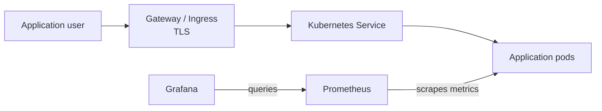

  <strong>INTERNAL DEVELOPER PLATFORM &nbsp;·&nbsp; SYSTEM DESIGN</strong>

<h1 align="center">Platform Architecture</h1>

  From an application change to a controlled, observable Kubernetes release.

  
  
  

  

  <a href="../README.md">Project overview</a> &nbsp;·&nbsp;
  <a href="#system-map">System map</a> &nbsp;·&nbsp;
  <a href="#first-runnable-release">First release</a> &nbsp;·&nbsp;
  <a href="#design-decisions">Design decisions</a>

---

This document describes the **target architecture**. The platform is under active development; the [roadmap](../README.md#project-roadmap) records implementation status.

## Design intent

The platform gives developers a consistent route to deploy containerized applications. Application source, built images, and deployment configuration have distinct roles, so a team can answer three questions at any time: **What changed? Which image is running? Why is that version deployed?**

The first implementation stays deliberately small: one local cluster and one example service. Each later component must make that path more repeatable, secure, or observable.

## System map

```mermaid
flowchart LR
    dev["Developer"] --> source["Application source<br/>Git"]
    source --> ci["CI<br/>test · build · scan"]
    ci --> registry[("Image registry")]

    dev --> change["Reviewed release change"]
    registry -.-> change
    change --> config["Deployment configuration<br/>Git"]
    config --> argo["Argo CD"]
    argo --> cluster["Kubernetes<br/>development environment"]
    registry -.-> cluster
    cluster --> observe["Health checks<br/>metrics · dashboards"]

    classDef buildStep fill:#192E4D,color:#FFFFFF,stroke:#4B8FD6;
    classDef releaseStep fill:#194740,color:#FFFFFF,stroke:#44BFA6;
    classDef runtimeStep fill:#382B52,color:#FFFFFF,stroke:#9B7CDD;
    class source,ci,registry buildStep;
    class change,config,argo releaseStep;
    class cluster,observe runtimeStep;
```

Solid arrows show a change moving through the workflow. Dotted arrows show the image version being selected for release and pulled by the cluster. The release change updates deployment configuration through review; CI does not write directly to the cluster.

## Component responsibilities

| Component | Responsibility | Output or evidence |
| --- | --- | --- |
| Application source | Holds service code and its tests. | A reviewed source change. |
| CI | Runs checks, builds an image, and scans it. | A verified, versioned image. |
| Image registry | Stores images that the cluster can pull. | An immutable image reference. |
| Deployment configuration | Declares the chosen image and environment settings in Git. | A reviewable release change. |
| Argo CD | Reconciles approved configuration with the cluster. | A visible sync state. |
| Kubernetes | Runs the service within resource and access boundaries. | A reachable, healthy workload. |
| Observability | Collects service health and performance signals. | Metrics and dashboards for investigation. |

## Application runtime

The target runtime gives application users one controlled entry point and gives operators a separate path to inspect service health:

The first runnable release only needs local access. A Gateway or Ingress and TLS will be added when the application needs a stable external route.

| Boundary | Target control |
| --- | --- |
| Workload access | RBAC limits who can change resources in each namespace. |
| Network access | Network policies allow only the traffic each service needs. |
| Shared resources | Requests, limits, and quotas prevent one workload from consuming the cluster. |
| Configuration and secrets | Real credentials stay out of Git; the delivery mechanism will be selected before secrets are required. |

## First runnable release

The first release has a narrow acceptance target:

1. A local Kubernetes cluster can be created from documented steps.
2. One example HTTP service runs in a development environment.
3. The service exposes a health endpoint and can be reached locally.
4. Its deployment configuration is stored in Git and contains no real credentials.

CI, GitOps reconciliation, staging, and dashboards follow once this baseline works. This gives every later addition a real service to validate against.

## Release and recovery path

When the delivery workflow is in place, CI will publish a versioned image after its checks pass. A release change will select that exact image reference in Git. After review, Argo CD will apply the desired state to Kubernetes. The team will verify service health before promoting the same image to another environment.

If a release is unhealthy, the recovery path is to revert the deployment change in Git and let Argo CD reconcile the previous known-good image. The image itself stays available in the registry, so recovery does not depend on rebuilding it.

## Environment boundaries

The first runnable service uses a development environment in a local cluster. Staging is added after the delivery path works. Separate namespaces will organize workloads and allow distinct access and resource policies; a local cluster is not presented as a production isolation boundary.

## Design decisions

| Decision | Reason |
| --- | --- |
| Keep deployment intent in Git. | Changes can be reviewed, compared, and reverted. |
| Deploy an immutable image reference. | The running artifact can be traced to a particular build. |
| Keep CI out of direct cluster deployment. | Argo CD remains responsible for applying the approved state. |
| Start with one service and one local cluster. | A small baseline makes each new platform component testable. |

The local cluster implementation, image registry, application entry point, and secrets approach will be selected when their requirements are clear. Each choice will be recorded with its reason and tradeoffs.
