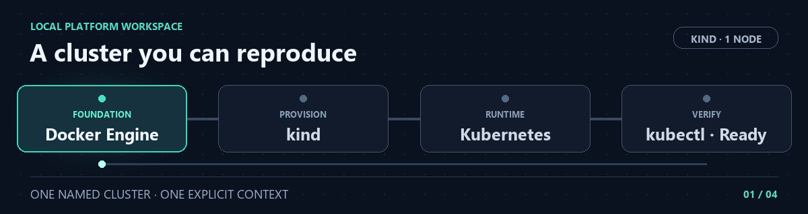

<p align="center">
  <strong>INTERNAL DEVELOPER PLATFORM &nbsp;·&nbsp; LOCAL ENVIRONMENT</strong>
</p>

<h1 align="center">Local Development</h1>

<p align="center">
  A dedicated Kubernetes workspace for building and validating the platform.
</p>

<p align="center">
  
  
  
</p>

<p align="center">
  
</p>

<p align="center">
  <a href="../README.md">Overview</a> &nbsp;·&nbsp;
  <a href="architecture.md">Architecture</a> &nbsp;·&nbsp;
  <a href="#create-the-cluster">Create</a> &nbsp;·&nbsp;
  <a href="#verify-the-cluster">Verify</a>
</p>

---

This guide provisions a **single-node, local Kubernetes cluster** for validating platform components and example workloads. The cluster is named `internal-developer-platform`, so it can coexist with other kind clusters on the same machine.

## How the pieces fit

| Layer | Role |
| --- | --- |
| Docker Engine | Runs the container that acts as the cluster node. |
| kind | Creates Kubernetes inside that node and manages the local cluster. |
| Kubernetes | Runs the control plane and, later, the platform's workloads. |
| kubectl context | Selects the cluster that a command talks to. |

The cluster itself runs on the local machine; it is not a file in Git. The commands below are the reproducible setup path. A kind configuration file will be added when the cluster needs non-default topology or networking.

## Prerequisites

Install Docker, kind, and kubectl. Confirm the Docker engine is running: `docker version` should show both **Client** and **Server** sections.

```bash
docker version
kind version
kubectl version --client
```

## Create the cluster

Check whether the named cluster already exists:

```bash
kind get clusters
```

If `internal-developer-platform` is absent, create it:

```bash
kind create cluster --name internal-developer-platform
```

kind creates one control-plane node by default and adds the kubectl context `kind-internal-developer-platform`. The default Kubernetes node image is selected by the installed kind release; check the resulting version during verification if compatibility matters.

## Verify the cluster

Query the intended cluster explicitly:

```bash
kubectl get nodes --context kind-internal-developer-platform
```

Expect `internal-developer-platform-control-plane` with status `Ready`. This confirms the node is available to run workloads; it does not imply that an application has been deployed.

The explicit `--context` is useful when several clusters share one kubeconfig. It keeps a command directed at this project even if the current context changes elsewhere.

<details>
<summary><strong>Remove the local cluster</strong></summary>

To remove this cluster and the workloads and data inside it, run:

```bash
kind delete cluster --name internal-developer-platform
```

This leaves the repository files intact. Create the cluster again with the command above when needed.

</details>

---

The next platform increment will deploy an example service to this cluster. The [architecture](architecture.md) describes the target delivery path and the boundaries of the first runnable release.
